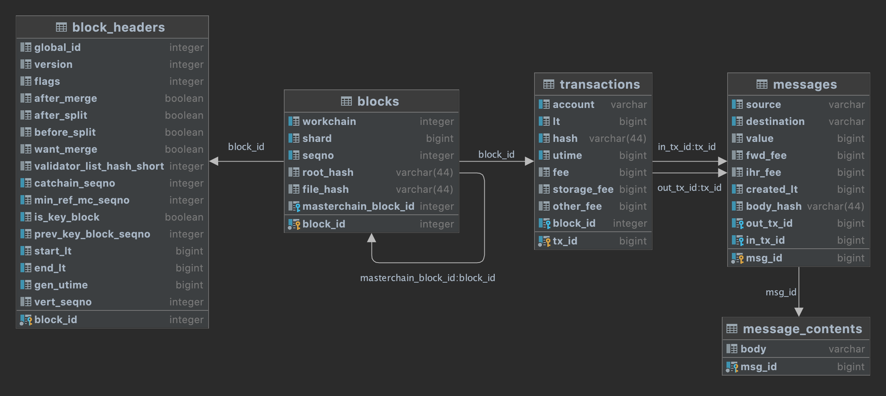

# TON Indexer

TON Indexer stores blocks, transactions, messages in Postgres database and provides convenient API.

## Building and running

Recommended hardware: 2 CPU, 16 GB RAM, 200 GB disk, SSD recommended.

Prerequisites: docker, docker-compose

  - Setup environment variables:
    - `TON_INDEXER_LITE_SERVER_CONFIG` *(required)* — path to liteserver config file with your liteserver. If config file contains more than 1 lite server the first one will be used.
    - `TON_INDEXER_START_SEQNO` *(required)* — masterchain seqno to start with. The service starts indexing from this value in 2 directions: to the latest blocks and to the earliest blocks.
    - `TON_INDEXER_BOTTOM_SEQNO` *(required)* — the earliest masterchain seqno. The service will not index blocks earlier this value. Make sure that this seqno exists in lite server that you are using.
    - `TON_INDEXER_HTTP_PORT` *(default: 80)* — port for API webserver.
    - `TON_INDEXER_BACKWARD_WORKERS_COUNT` *(default: 5)* — number of parallel workers to process backward direction.
    - `TON_INDEXER_FORWARD_WORKERS_COUNT` *(default: 2)* — number of parallel workers to process forward direction.
  - Create file `private/postgres_password` containing password to the Postgres database (without newline).
  - Build services: `docker-compose build`.
  - Run services: `docker-compose up -d`.
  - Stop services: `docker-compose down`. Run this command with`-v` flag to remove volume with Postgres DB.

## DB schema



## FAQ
### How to point the service to my own lite server?

To use your own lite server you should set `TON_INDEXER_LITE_SERVER_CONFIG` to config file with your only lite server.

- If you use MyTonCtrl on your node you can generate config file with these commands: 
    ```
    $ mytonctrl
    MyTonCtrl> installer
    MyTonInstaller> clcf
    ```
    Config file will be saved at `/usr/bin/ton/local.config.json`.
- If you don't use MyTonCtrl: copy `config/mainnet.json` and overwrite section `liteservers` with your liteservers ip, port and public key. To get public key from `liteserver.pub` file use the following script:
    ```
    python -c 'import codecs; f=open("liteserver.pub", "rb+"); pub=f.read()[4:]; print(str(codecs.encode(pub,"base64")).replace("\n",""))'
    ```
- Once config file is created assign variable `TON_INDEXER_LITE_SERVER_CONFIG` to its path, run `./configure.py` and rebuild the project.
